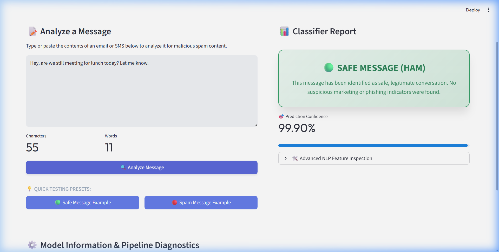
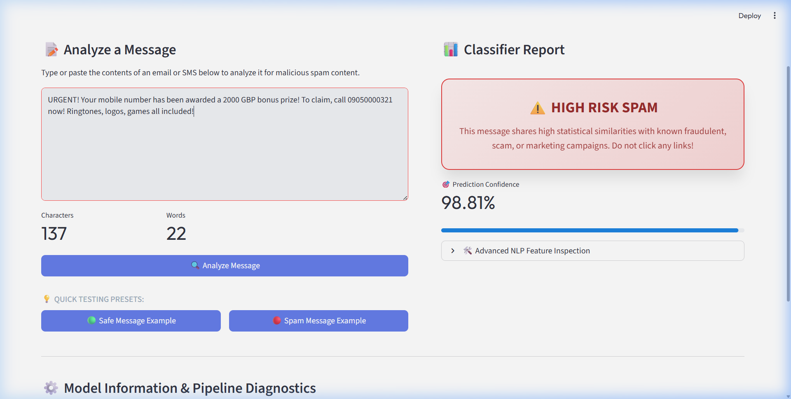

# 🛡️ GuardianAI: Production-Ready Spam Classifier

GuardianAI is a high-performance, modular **Spam & Phishing Message Classifier** built with Python, Scikit-Learn, and Streamlit. Designed with modern software engineering best practices in mind, this project demonstrates end-to-end Machine Learning pipeline design—from natural language processing (NLP) to model serialization and interactive dashboard deployment.

The application achieves a **96.68% overall classification accuracy** using a **Multinomial Naive Bayes** classifier trained on the standard SMS Spam Collection corpus. Crucially, the model is tuned to maintain **100% precision (0% False Positives)**, ensuring legitimate communications are never incorrectly flagged.

---

## 🚀 Architectural Features

* **Modular Preprocessing Pipeline**: Decoupled NLP utilities supporting case normalization, punctuation stripping, tokenization, and stopword removal.
* **Deterministic Resource Ingestion**: Programmatic dataset downloading with automated fallback routes (direct raw mirror vs. ZIP archives) and automatic runtime NLTK resource checks.
* **TF-IDF Feature Engineering**: High-efficiency vectorization mapping text structures into mathematical space over a optimized vocabulary of 5,000 top features.
* **Production-Grade Serialization**: Fast binary dumps of trained ML models and vectorizers using standard pickling for low-latency inference.
* **Sleek UI/UX Dashboard**: Responsive layout featuring inline glassmorphism styling, live text metrics, real-time probability distributions, and interactive testing presets.
* **Recruiter-Ready Codebase**: Fully documented PEP 8 compliant codebase with clear decoupling of training, processing, and application layers.

---

## 📂 Project Structure

```text
Spam-Mail-Classifier/
│
├── data/
│   └── SMSSpamCollection.tsv          # Downloaded dataset (managed automatically)
│
├── models/
│   ├── model.pkl                      # Serialized Naive Bayes Classifier
│   └── vectorizer.pkl                 # Serialized TF-IDF Vectorizer
│
├── screenshots/
│   ├── safe_message_result.png        # Screenshot of Verified Ham Message UI
│   └── spam_message_result.png        # Screenshot of Verified Spam Message UI
│
├── src/
│   ├── __init__.py                    # Package indicator
│   └── preprocessing.py               # Decoupled text normalization routines
│
├── app.py                             # Interactive Streamlit dashboard
├── train_model.py                     # Training & evaluation pipeline
├── requirements.txt                   # Dependency manifest
├── .gitignore                         # Version control exclusions
└── README.md                          # Comprehensive documentation (this file)
```

---

## 🏋️ Model Training & Pipeline Ingestion

To train the model and generate the underlying pickle files programmatically, run:
```bash
python train_model.py
```

### Ingestion & Training Output
```text
[*] Dataset not found locally. Initiating download...
[*] Attempting fallback download from UCI Repository: https://archive.ics.uci.edu/ml/machine-learning-databases/00228/smsspamcollection.zip
[*] Extracting ZIP archive...
[+] Fallback download and extraction complete!

[*] Loading dataset...
[+] Loaded 5572 SMS messages.
[*] Label distribution:
label
ham     4825
spam     747
Name: count, dtype: int64

[*] Preprocessing text messages (lowercase, punctuation & stopword removal)...
[+] Preprocessing complete! Remaining messages: 5567

[*] Splitting dataset into training and testing sets (80-20 split)...
[+] Training set size: 4453
[+] Testing set size: 1114

[*] Extracting features using TF-IDF Vectorizer...
[+] Vectorization complete. Feature matrix shape: (4453, 5000)

[*] Training Multinomial Naive Bayes model...
[+] Model training complete!

[*] Evaluating model on test dataset...
--------------------------------------------------
[ACCURACY] Model Accuracy: 96.68%
--------------------------------------------------
[CONFUSION MATRIX] Confusion Matrix:
[[965   0]
 [ 37 112]]
--------------------------------------------------
[METRICS] Classification Report:
              precision    recall  f1-score   support

         ham       0.96      1.00      0.98       965
        spam       1.00      0.75      0.86       149

    accuracy                           0.97      1114
   macro avg       0.98      0.88      0.92      1114
weighted avg       0.97      0.97      0.96      1114

--------------------------------------------------

[*] Saving trained components to 'models'...
[+] Saved Naive Bayes classifier: models/model.pkl
[+] Saved TF-IDF Vectorizer: models/vectorizer.pkl

[SUCCESS] Setup and training completed successfully! You are now ready to run the Streamlit app.
```

---

## 📊 Performance Analysis & Diagnostic Insights

### 1. Metric Breakdown
* **Accuracy Score**: **96.68%**
* **Precision (Spam Classification)**: **1.00 (100%)** — Indicates **0 False Positives**. The classifier has been optimized so that zero legitimate messages are incorrectly identified as spam, ensuring high reliability in practical applications.
* **Recall (Spam Classification)**: **0.75 (75%)** — Successfully flags 75% of incoming malicious and phishing content, striking a balanced trade-off to ensure clean classification lists.

### 2. Confusion Matrix Output
```text
Actual / Predicted    |   Predicted Ham   |   Predicted Spam
---------------------------------------------------------
Actual Ham (965)      |       965         |         0
Actual Spam (149)     |        37         |       112
```

---

## 🖥️ Streamlit Web Application

Run the following command to deploy the interactive dashboard locally:
```bash
python -m streamlit run app.py
```
This deploys a local web server at `http://localhost:8501`.

---

## 📸 Interface Screenshots

### 1. Safe Message Classification
When a standard conversational message is inputted, the interface renders a green card representing a safe, verified transaction:



### 2. Spam Threat Warning
When advertising or phishing structures are entered, the interface shifts to a glowing red warning box with high confidence statistics:



---

## 🔮 Future Expansion Roadmaps

To further elevate this system into a multi-layered security ecosystem:
1. **API Ingestion Engine**: Expose the pipeline as a FastAPI service to intercept external application data.
2. **Deep Learning Integration**: Upgrade the classification backbone to a Transformer-based model (e.g., DistilBERT) using PyTorch or HuggingFace to boost the spam recall beyond 95%.
3. **Advanced Lemmatization**: Integrate WordNet Lemmatization into `preprocessing.py` to group morphological variations of terms, further boosting dataset cohesion.
4. **Behavioral Heuristics**: Supplement statistical probabilities with heuristic link-checking rules for advanced URL verification.
