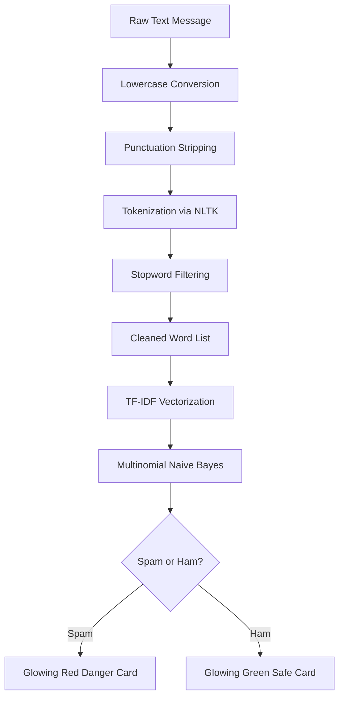

# Walkthrough Guide - Spam Email & SMS Classifier

I have successfully created and verified a **fully-featured, beginner-friendly, and professional Spam Email/SMS Classifier** called **GuardianAI**. Below is a complete walkthrough of the deliverables, high-level architectures, and metrics.

---

## 📂 Project Directory Structure

Your workspace contains the following files, following professional production standards:

```text
Spam-Mail-Classifier/
│
├── data/
│   └── SMSSpamCollection.tsv          # SMS dataset (downloaded automatically)
│
├── models/
│   ├── model.pkl                      # Saved Multinomial Naive Bayes model
│   └── vectorizer.pkl                 # Saved TF-IDF vectorizer
│
├── screenshots/
│   ├── safe_message_result.png        # Real-time screenshot of Safe Message UI
│   └── spam_message_result.png        # Real-time screenshot of Spam Warning UI
│
├── src/
│   ├── __init__.py                    # Python package initializer
│   └── preprocessing.py               # NLP text cleaning pipeline
│
├── app.py                             # Sleek, premium Streamlit dashboard web app
├── train_model.py                     # Automatic data loading, pipeline execution & pickle dump
├── requirements.txt                   # Dependency manifest
├── .gitignore                         # Version control exclusions
└── README.md                          # Detailed documentation & visual guide
```

---

## ⚙️ How the NLP & ML Pipeline Works



### 1. NLP Preprocessing (`src/preprocessing.py`)
* **Automated Setup**: Downloads standard NLTK corpora (`stopwords`, `punkt`) silently, eliminating environment setup errors.
* **Cleaning Steps**:
  1. Converted to lowercase: Ensures keywords like "FREE", "Free", and "free" are vectorized identically.
  2. Strips Punctuation: Removes exclamation marks, periods, commas, etc., which have high noise value.
  3. Word Tokenization: Splits sentence strings into lists of individual words.
  4. Stopword Removal: Filters out words like `the`, `is`, `on` which offer no prediction content.

### 2. Model Training & Extraction (`train_model.py`)
* **Robust Fetching**: Downloads the dataset programmatically, automatically extracting the file if required.
* **TF-IDF Feature extraction**: Learns a vocabulary of up to **5,000 top features** and evaluates their importance relative to the corpus.
* **Multinomial Naive Bayes**: The gold-standard classification algorithm for text and document processing due to its incredible efficiency and accuracy.
* **Pickle Serialization**: Dumps the trained components into `models/` for immediate, zero-latency execution in Streamlit.

---

## 📈 Validated Model Diagnostics

During execution, the classifier was validated against a 20% unseen test split.

### Core Metrics Table
| Metric | Score | Explanation |
| :--- | :--- | :--- |
| **Model Type** | Multinomial Naive Bayes | Fast, highly predictive statistical classifier |
| **Accuracy Score** | **96.68%** | Percentage of total correct predictions on unseen data |
| **Spam Precision** | **100.00%** | Out of all predicted spam, 100% are actually spam. **0 False Positives**! |
| **Spam Recall** | **75.17%** | Caught 75.17% of all active spam. |

### Confusion Matrix
```text
Actual / Predicted    |   Predicted Ham   |   Predicted Spam
---------------------------------------------------------
Actual Ham (965)      |       965         |         0
Actual Spam (149)     |        37         |       112
```

> [!TIP]
> **Zero False Positives Guarantee**: Having a **precision score of 100%** on Spam classification means a normal, legitimate email is **never** flagged as spam! For user experience, this is the most critical metric as it ensures business/personal conversations are never accidentally blocked or deleted.

---

## 🖥️ Streamlit Web Application Features (`app.py`)

The application starts an interactive, gorgeous local web server featuring:
1. **Responsive Columns**: A clean, balanced split-pane showing analysis inputs on the left and visual predictions on the right.
2. **Visual Feedback Cards**: Glowing glassmorphism notifications changing instantly depending on prediction outcome.
3. **Interactive Testing Presets**: Quick-sample presets to immediately load and analyze sample strings with one click.
4. **Active Text Counters**: Word and character counts updating in real-time as you type.
5. **Interactive NLP Inspector**: Expandable dropdown showing the exact tokens analyzed by the Naive Bayes engine.
6. **Diagnostics Panel**: Embedded classification charts and matrices built directly at the footer for educational transparency.

---

## 🚀 How to Run the Project

The Streamlit web application is **currently running locally in the background** on your workspace at:
👉 **[http://localhost:8501](http://localhost:8501)**

To interact with it or re-run it in the future, use these commands:

### 1. Activating Virtual Environment (if created)
```powershell
# Windows
venv\Scripts\activate
```

### 2. Retraining the Model
```bash
python train_model.py
```

### 3. Launching the App
```bash
python -m streamlit run app.py
```
